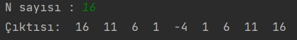

# Desene Göre Metot Oluşturma
Java dilinde kullanıcıdan alınan n değerine göre aşağıdaki kurala uyan döngü kullanmadan bir "Recursive" metot yazın.

## Kural:
Girilen sayı 0 veya negatif olduğu yere kadar girilen sayıdan 5 rakamını çıkarın. Her çıkarma işlemi sırasında ekrana son değeri yazdırın. Sayı negatif veya 0 olduktan sonra tekrar 5 ekleyin. Yine her ekleme işleminde sayının son değerini ekrana yazdırın.

## Seneryolar

### Senaryo 1

### Senaryo 2

### Senaryo 3

### Senaryo 4
